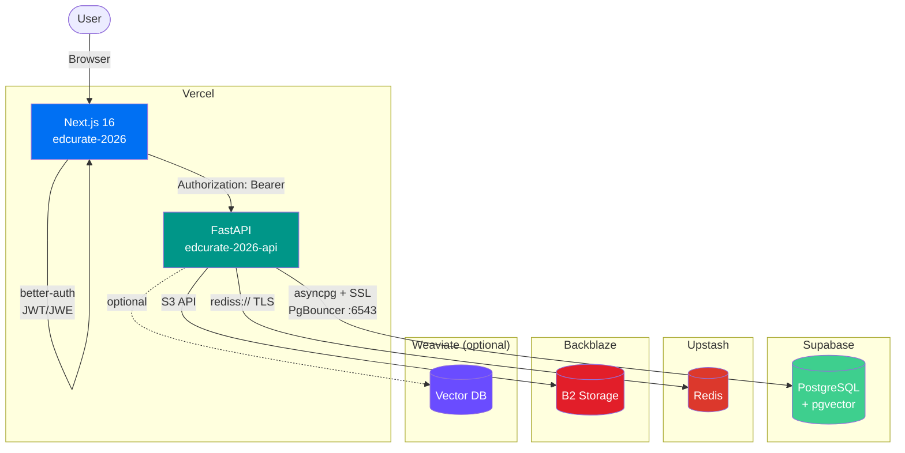

# System Architecture

## Production Infrastructure



**Auth flow:** better-auth (Web) → localStorage JWT/JWE → `Authorization: Bearer` header → FastAPI validates JWE

**Storage:** Teacher uploads → Backblaze B2 (S3-compatible, local: MinIO)

**Vector search:** pgvector (Supabase) by default, Weaviate optional for scale

---

## Pipeline Overview

```
Input -> Search -> RAG -> Verification -> Proposal & Recommendation
```

## 1. Input

Collect student information while observing PII rules. Curriculum data can be provided directly or generated from available information.

- Student profile (age, level, background, learning goals)
- Curriculum / subject context
- PII anonymisation at ingestion

## 2. Search Engine

Retrieve relevant educational resources from external sources.

- Brave Search API
- DuckDuckGo API
- YouTube Data API

## 3. RAG (Retrieval-Augmented Generation)

Process and index retrieved content for context-aware generation.

- Chunking
- Indexing
- Embedding

## 4. Verification using Agents

Ensure content accuracy and safety through multi-agent review.

- **Adversarial Agent** — challenges factual claims, detects hallucinations
- **Referencing Agent** — cross-checks against authoritative curriculum sources

## 5. Proposal & Recommendation

Generate tailored educational content and resource recommendations.

- Resources suited to different learner levels
- Culturally and contextually appropriate materials
- Adapted to diverse backgrounds and learning goals
