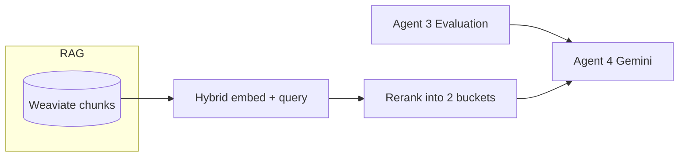

# Agent 4 — Adversarial Review Agent — Design Document

**Date:** 2026-04-05  
**PRD reference:** `docs/PRD.md` — §4 pipeline diagram, §4.3 RAG usage for Agent 4, §4.4 Agent 4 specification, §9.2 step 5 (Adversarial Agent)  
**Related:** `docs/plans/rag-evaluation-pipeline-design.md` (Agent 3 + RAG)

## 1. Goals and scope

**Purpose (PRD):** Challenge Agent 3’s evaluations to catch false positives, hidden bias, accuracy gaps, safety edge cases, and licensing traps — **one chained LLM call after Agent 3**, not an iterative debate.

**Scope chosen:**

- **B (PRD-aligned outputs + RAG support):** Structured adversarial output (flags, verdict, optional score adjustments) plus retrieval that surfaces both **claim-heavy** and **framing-sensitive** evidence for the model.
- **Approach 3 (implementation):** **Single hybrid** `near_vector` query + **client-side rerank** into two labeled context blocks (not two separate Weaviate round-trips). Mitigates PRD fidelity vs. latency/cost.

**Non-goals (this document):** Agent 5 (localisation), orchestrator learning, curriculum KB seeding, UI polish beyond what OpenAPI-driven types enable.

---

## 2. Architecture overview

**Pipeline position:** RAG indexed → Agent 3 (`evaluate_resource`) → **Agent 4** → response. Same parallelism pattern as evaluation where practical.

| Component | Role |
|-----------|------|
| **Hybrid query builder** | One embedding string: teacher/search context + instructions to surface verifiable claims (stats, dates, causal assertions) and wording that may encode bias, exclusion, or sensitive framing. Uses same embedding path as evaluation (e.g. `embed_single` / Vertex `text-embedding-004`). |
| **Weaviate read** | Existing `query_chunks` with **higher `limit`** than Agent 3 (e.g. 12–16 vs 5), same filters: `search_id` + `resource_url`. |
| **Rerank / bucket allocator** | Deterministic heuristics (regex + small keyword lists): **claim-likeness** vs **framing-likeness**. Dedupe by `chunk_index`; cap characters per bucket for prompt bounds. |
| **Adversarial LLM** | One Gemini call (same operational stack as Agent 3). Input: Agent 3 result JSON + `CLAIM_FOCUSED_CHUNKS` + `FRAMING_FOCUSED_CHUNKS` + optional short global excerpt for tone. Output: strict JSON → Pydantic. |
| **Schemas** | New models for flags and review; extend `EvaluationResult` with optional `adversarial`. |

**Trade-off (Approach 3):** One vector query may miss edge cases a dedicated framing embedding would catch; mitigated by **higher limit**, **rerank**, and a **tight adversarial rubric** in the prompt.

---

## 3. Key interfaces and contracts

### 3.1 Pydantic models

**`AdversarialFlag`**

- `category`: `false_positive` | `hidden_bias` | `accuracy_gap` | `safety` | `licensing_trap`
- `severity`: `high` | `medium` | `low`
- `explanation`: `str`
- `suggested_action`: `str`

**`AdversarialReviewResult`**

- `verdict`: `approved` | `approved_with_caveats` | `flagged_for_teacher_review` | `not_recommended`
- `flags`: `list[AdversarialFlag]`
- `score_adjustments`: `dict[str, DimensionScore]` — **only changed dimensions**; reuse existing `DimensionScore`; empty object = Agent 3 scores stand
- `review_summary`: `str` (teacher-facing)

**`EvaluationResult` (extend)**

- `adversarial: AdversarialReviewResult | None = None`

**`EvaluatedSearchResponse`**

- No new top-level field required; adversarial rides on each `EvaluationResult`.

### 3.2 Internal API (suggested modules)

- `src/evaluation/adversarial_agent.py` — Gemini call, JSON parse, retry (mirror Agent 3).
- `src/evaluation/adversarial_retrieval.py` — `build_adversarial_hybrid_query_text`, `bucket_chunks_for_adversarial`.

Functions (names indicative):

- `build_adversarial_hybrid_query_text(preset, query, title, url, source) -> str`
- `bucket_chunks_for_adversarial(chunks: list[dict], ...) -> tuple[str, str]`
- `async def adversarial_review_resource(..., evaluation: EvaluationResult, ...) -> AdversarialReviewResult | None`

Constants: `ADV_RETRIEVAL_LIMIT`, per-bucket char caps, optional keyword config.

### 3.3 HTTP / OpenAPI

- `GET /discovery/search` response gains nested `adversarial` on each evaluation object when present.
- **v1:** Optional fields on `ResourceCard` for verdict/caveats deferred; UI can read from `evaluations[]` by URL match.

### 3.4 LLM I/O

- **Output JSON** maps to `AdversarialReviewResult` (snake_case). Required: `verdict`, `flags`, `score_adjustments`, `review_summary`.

---

## 4. Integration points

### 4.1 `discovery/service.py` — `_run_rag_pipeline`

After current Step 5 (parallel `evaluate_resource` + sort):

**Step 6 — adversarial**

1. Build hybrid query text; `adv_vector = await embed_single(...)`.
2. For each top-card with an `EvaluationResult`, in parallel: `query_chunks(..., limit=ADV_RETRIEVAL_LIMIT)` → bucket → `adversarial_review_resource`.
3. Attach `evaluation.adversarial = result` or `None` on failure.

**Timeouts:** Consider a dedicated budget for Step 6; on total adversarial failure, return evaluations with `adversarial=None`.

### 4.2 RAG / Weaviate

- No schema migration; reuse `query_chunks` with different limit and query vector.

### 4.3 Frontend

- Regenerate API types from OpenAPI.
- Display verdict, flags, and effective scores (merge `score_adjustments` over base scores or show deltas when keys present).

---

## 5. Edge cases and error handling

| Area | Behaviour |
|------|-----------|
| Empty hybrid retrieval | Snippet fallback for buckets; prompt notes low evidence; model may flag uncertainty. |
| Malformed JSON | One stricter retry; then `adversarial=None`, evaluation stands. |
| Schema validation failure | Same as malformed after retry. |
| Weaviate / per-resource errors | `adversarial=None` for that resource; log. |
| Hybrid embedding failure | Skip adversarial for all resources in batch; keep evaluations. |
| Gemini timeout / rate limit | Per-resource `None` or isolated task timeouts so siblings succeed. |
| Safety | Prefer `flagged_for_teacher_review` / `not_recommended` when appropriate. |
| Clean bill of health | `flags=[]`, `approved`, empty `score_adjustments`, short summary. |
| Optional hardening | If too many dimensions change at once, withhold numeric adjustments and rely on flags + caveat verdict (post-hackathon). |

---

## 6. Transition to implementation

Design approved. Run `/plan` (or project planning workflow) to decompose into tasks: schemas, retrieval helpers, agent module, `service.py` Step 6, OpenAPI regen, minimal UI surfacing.
