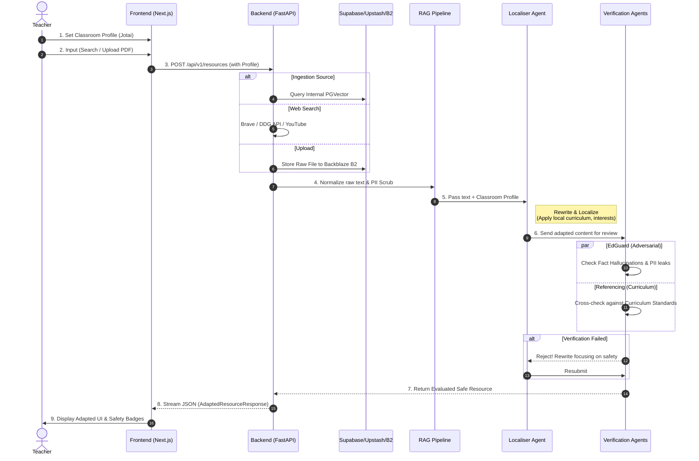
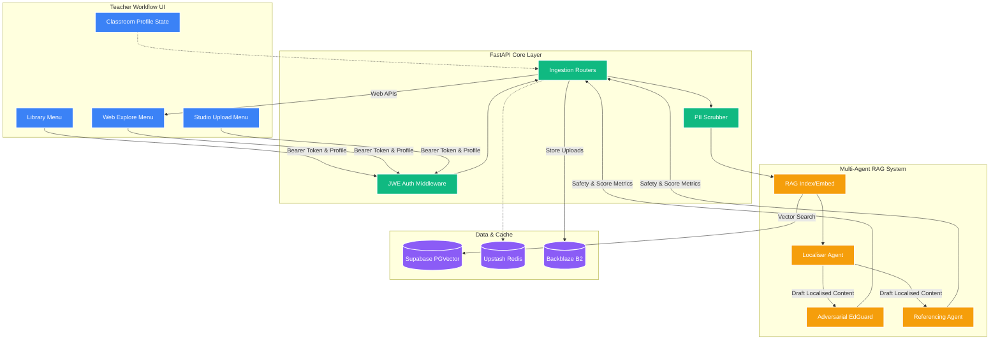

# 🚀 EduCurate: Hackathon Pitch & Architecture Visuals

This document serves as a visual aid for the team and judges, explaining the system architecture and our approach to building **ContextBridge (EduCurate Resource Discovery)**.

---

## 1. Hackathon Strategy

To meet the judging criteria for **"Trusted, Localised Resources,"** we deliberately avoided building a generic chatbot.
Instead, we focused on building a **robust, verifiable pipeline** that aggregates fragmented resources (Ingestion), rigorously tests them via AI (Verification), and shapes them exactly to a teacher's unique classroom environment (Adaptation).

* **The Problem:** Widespread resource fragmentation ↔ Extreme time poverty ↔ Untrustworthy generic AI outputs.
* **Our Solution:** A Multi-Agent automated pipeline doing the heavy lifting: **"Discover → Red-Team Verification → Contextual Adaptation"**.

---

## 2. Core Product Features (Teacher's View)

To save teachers time, we built a seamless, tabbed interface where they don't have to write complex AI prompts.

1. **Global Classroom Context (Set it & Forget it):** Teachers define their classroom profile once (e.g., "Year 8, rural demographics, low reading comprehension"). This context automatically applies to all future actions.
2. **Unified Discovery Hub:**
   * **Internal Library:** Search vetted, proprietary resources from our database.
   * **Web Explorer:** Search the live web (Brave/DDG) and YouTube for fresh content.
   * **Personal Studio:** Drag-and-drop legacy teacher PDFs and docs.
3. **One-Click Adaptation:** Instantly rewrite any found resource to match the Classroom Context—simplifying vocabulary, changing cultural references, or adding scaffolding.
4. **Trust Badges (EdGuard Evaluated):** Every adapted resource displays clear "Verified" UI badges, proving it passed PII stripping, hallucination checks, and curriculum standards.

---

## 3. System Architecture & Data Flow

This Sequence Diagram demonstrates the teacher's journey from searching for a resource to securely receiving a verified, localized lesson plan.

---

## 4. Core Component Diagram

This graph explains how our production infrastructure natively connects to our UI interfaces and Verification AI logic.

---

## 5. Pitch Script Guide for Team Leaders

When showing these diagrams up on the screen, use these talking points to clearly communicate the value payload:

> 1. **The Unified Experience (Frontend):** "Teachers set their unique 'Classroom Context' (e.g., Year 8, rural demographics, specific learning hurdles) precisely once. Whether they're exploring our proprietary database, running a live web search, or dragging in a local PDF, the file goes through the exact same adaptation pipeline."
> 2. **Built on Trust & Security (Backend):** "For educational use, privacy is non-negotiable. Before any prompt even touches the core LLMs, the student data passes through an automated PII (Personally Identifiable Information) masking shield."
> 3. **The Adversarial AI Pipeline (The Secret Sauce):** "We don't just blindly trust what the AI adapts. We implemented a 'Red-Teaming' architecture. The **EdGuard Agent** (acting as a safety and bias evaluator) and the **Referencing Agent** rigorously cross-examine the newly generated content. If it fails curriculum alignment or hallucinates contexts, they reject it automatically. Our teachers only receive the finalized, perfectly-adapted outcomes flanked by green safety badges."
